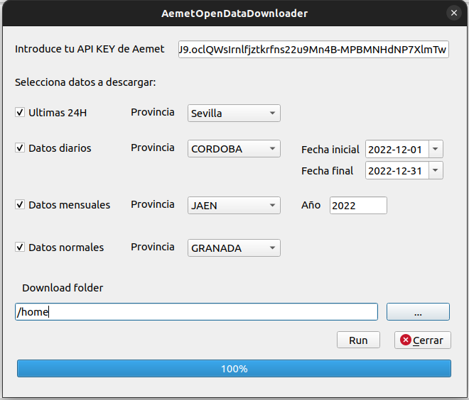

# AEMET OPEN DATA DOWNLOADER (V1.0)

Plugin de QGIS para la descarga por provincias de los datos meteorologicos de las ultimas 24h, diarios, mensuales y normales en qgis de los Open Data de AEMET.

La información que recoge y utiliza este plugin es propiedad de la Agencia Estatal de Meteorología.

AEMET OpenData es un API REST (Application Programming Interface. Representational State Transfer) a través del cual se pueden descargar gratuitamente los datos explicitados en el Anexo II de la resolución de 30 de diciembre de 2015 de AEMET, por la que se establecen los precios públicos que han de regir la prestación de servicios meteorológicos y climatológicos. Esta resolución ha sido publicada en el BOE nº 4 de 5 de enero de 2016. (<a href='https://opendata.aemet.es/centrodedescargas/inicio'>https://opendata.aemet.es/centrodedescargas/inicio</a>)

Para poder acceder a AEMET OpenData, es necesario solicitar una API Key. Una API Key es un identificador, mediante el cual se contabilizan e imputan los accesos que un usuario realiza al API. 

# APY KEY

Obtén tu clave de API en la siguiente URL: (<a href='https://opendata.aemet.es/centrodedescargas/altaUsuario?'>https://opendata.aemet.es/centrodedescargas/altaUsuario?</a>)

## Instalar plugin

**Disponible para Qgis 3.0.*** o superior

El complemento puede descargarse con el archivo zip desde este repositorio y <b>descomprimirlo en la carpeta de plugins de QGIS</b> según el sistema operativo. O instalarse directamente en Qgis con el archivo zip.

## Uso

Tras su instalación el plugin puede ser ejecutado desde la barra de herramientas o bien desde el menú <b>Complementos>AemetOpenDataDownloader</b>

Una vez ejecutado el complemento se debe <b>obligatoriamente</b>:
<ul>
<li>Introducir la API Key</li>
<li>Marcar los tipos de datos (capas) que se quieren descargar</li>
<li>Seleccionar las provincias y, o, los años o fechas corrspondientes</li>
<li>Introducir la carpeta de destino</li>
</ul>

El programa realiza:

   - la consulta a la API REST obteniendo las direcciones web a los datos solicitgados.
   - Descarga los datos en formato JSON.
   - Crea un CSV con los Json de todas las estaciones por provincia y tipo de dato solicitado, añadiendo los datos necesarios para su georeferenciación.
   - Carga el CSV como una capa en QGIS.

### Conjunto de datos, documentos e imagenes de la API REST de Aemet OPENDATA

En negrita aquellos datos que se descargan y georeferencia:

- **Datos de observación**, radiación y contaminación de fondo.
- Imágenes de radar, mapas de rayos y productos derivados de satélite.
- **Datos climatologicos diarios, mensuales, valores normales** y otros productos climatológicos.
- Predicciones normalizadas en texto, predicciones específicas, predicciones
marítimas.
- Mapas significativos, de análisis y previstos.
- Avisos de fenómenos meteorológicos adversos e índices de incendios.

El PDF con la descripción completa del servicio puede consultarse en el siguiente [enlace](https://opendata.aemet.es/centrodedescargas/docs/FAQs170621.pdf)

Ejemplo de uso del Plugin:

## Changelog
- 25.04.2023 V1.0: Primera versión

